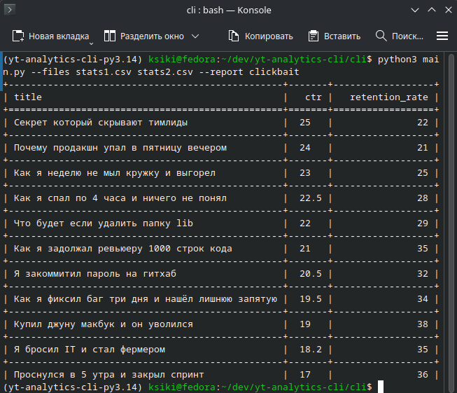

# yt-analytics-cli

Вроде как по всем требованиям ТЗ, старался ничего не упустить.
Так-же как и просится в ТЗ, старался спроектировать все так, что бы была возможность легко добавлять новые виды отчетов.
Для этого нужно:
- Создать файл с именем `{ВидОтчета}_report.py`
- Создать в нем класс с именем `{ВидОтчета}Report`
- Добать новый вид отчета в Config к Аргументу `--report` в choices. 

## Пример запуска

``` bash
python3 main.py --files stats1.csv stats2.csv --report clickbait
```
<p align="center">
  
</p>
